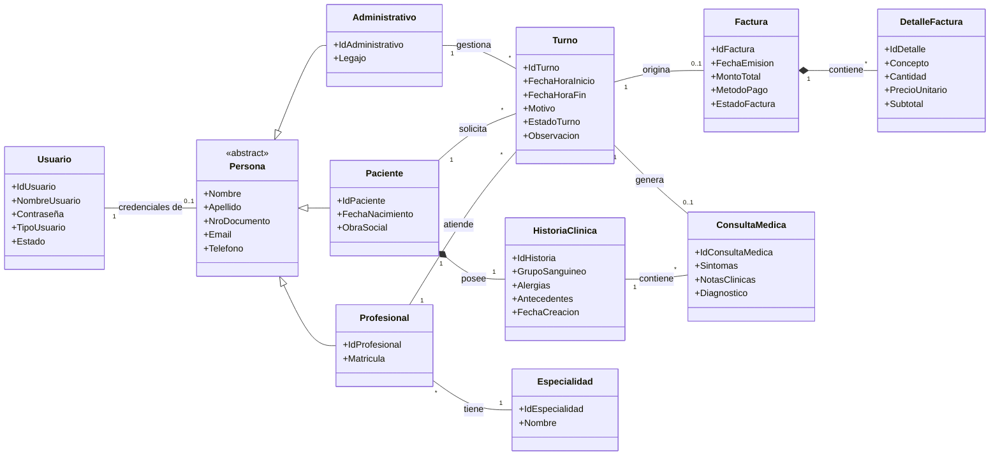

# Propuesta de Trabajo Práctico Integrador

## Sistema de Gestión de Turnos Médicos

**Integrantes:**

- Alejo Mistraletti (52665)
- Lucas Alonso (52904)
- Marco Bernaus (52172)

**Asignatura:** Tecnologías de Desarrollo de Software IDE
**Comisión:** 3EK01
**Docentes:** Ezequiel Porta y Severino Guimpel

## Descripción

Sistema de gestión para consultorios médicos que permite administrar pacientes, profesionales, especialidades, turnos y su facturación. El sistema centraliza los datos médicos de cada paciente en una Historia Clínica, la cual agrupa todas sus consultas a lo largo del tiempo, mientras que un módulo administrativo paralelo gestiona el cobro y estado de cuenta de las prestaciones realizadas.

## Diagrama de Clases

## Roles

1. **Administrativo:** Gestiona la agenda de turnos (asignación, reprogramación y cancelación de turnos). Se encarga de emitir y gestionar la facturación de los turnos. Además gestiona los datos maestros del sistema (altas y modificaciones de Especialidades y Profesionales).

2. **Profesional:** Accede a su agenda de turnos asignados. Puede visualizar los antecedentes en la Historia Clínica del Paciente y registrar las Consultas Médicas realizadas completando diagnósticos y notas clínicas necesarias.

3. **Paciente:** Accede al sistema para autogestionar la solicitud de turnos, visualizar el cronograma de sus próximos turnos y consultar un registro básico de sus atenciones previas.

## CRUDs

1. **CRUD Pacientes** (Gestión de datos personales y obra social).

2. **CRUD Profesionales** (Gestión de datos personales, matrícula y asignación de especialidad).

3. **CRUD Especialidades** (Administración de datos maestros).

4. **CRUD Turnos** (Incluye búsqueda con filtros, por ejemplo: búsqueda por rango de fechas, profesional o estado del turno).

5. **CRUD Consultas Médicas** (Registro realizado por el médico sobre la atención de un Turno para vincularlo a la Historia Clínica).

6. **CRUD Facturación** (Implementación del patrón Maestro/Detalle mediante las entidades Factura y DetalleFactura).
